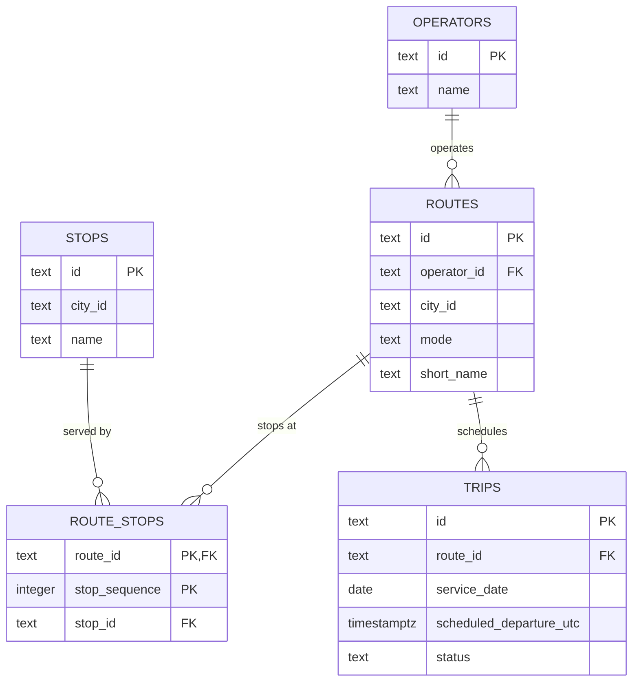

# Lecture 1 implementation lab

## Purpose

Build the smallest relational model that supports route maintenance and upcoming-trip queries. The implementation is not expected to represent the complete MobilityTicketing platform. It should make your modelling assumptions executable.

## Timebox

Approximately 90 minutes.

## Work in this lecture

1. Create tables for operators, routes, stops, route stops, and trips.
2. Decide the primary key of the route-stop relation and explain the decision.
3. Add primary-key and foreign-key relationships.
4. Insert the supplied seed data.
5. Write the three workload queries in `database/postgres/003_queries.sql.example`.
6. Compare the implemented schema with your ER diagram and record any difference.

## Workload queries

1. Show the next 20 scheduled trips for a route after a supplied timestamp.
2. Show the ordered stops belonging to a route.
3. Show all routes and the number of scheduled trips on a supplied service date, including routes with no trips.

## Do not implement yet

Do not add MongoDB, Redis, caching, event queues, payment logic, validation logic, reporting tables, or performance indexes. Those decisions are introduced later.

## Required evidence

- A schema that can be recreated from an empty database.
- Seed data that can be loaded more than once without manual editing.
- The three queries and representative results.
- A short note identifying one modelling assumption that may change later.
- A system context, access-pattern map, ER diagram, and one functional dependency note.

## Submission checklist

- [x] Describe the customers, operators, and city transport context without naming a database product.
- [x] Cover route search, ticket purchase, ticket validation, timetable updates, real-time availability, and reporting in the access-pattern map.
- [x] Include identifiers, relationships, and cardinalities in the ER diagram.
- [x] Explain one functional dependency and what normalization prevents.
- [x] State what the implementation proves and what remains unknown.
- [x] Commit the implementation under `database/postgres/`.


---
## Solution — Allan

### System context
MobilityTicketing aggregates the bus, tram, and train services of a single city
into one platform. Two groups of people use it.

Customers search for journeys between stops, see departures and delays, buy
digital tickets, and present those tickets when boarding. They interact with the
system in short bursts, often on a phone, often under time pressure at a stop.

Operators are the transport companies whose vehicles run the services. They
maintain routes and timetables, manage products and prices, and read usage and
revenue reports. Their work is less frequent than customer activity but changes
the data that customers read.

The city context matters for scale and shape of load: demand is concentrated in
morning and afternoon rush hours, journeys are short, and the same small set of
routes and stops is read repeatedly by very many customers.

This lecture implements only the route and timetable slice: operators, routes,
stops, the ordered stop pattern of a route, and the individual trips scheduled
on a route for a service date.

### Access-pattern map
| Workload | Actor | Entities touched | Read/write | Latency | Staleness tolerated |
|---|---|---|---|---|---|
| Journey search | Customer | routes, stops, route_stops, trips, products, availability | Read-heavy | Low | Yes — a slightly stale option list is still useful |
| Ticket purchase | Customer | trips, products, tickets, payments, availability | Read + write | Moderate | No — must be correct |
| Ticket validation | Customer | tickets, validations, trips | Read + small write | Very low | No for the ticket; reporting may lag |
| Timetable maintenance | Operator | routes, route_stops, trips | Write-heavy, bulk | High tolerance | Changes may become visible gradually |
| Real-time availability | Both | trips, availability | Read >> write | Low | Depends: display may be stale, purchase may not |
| Reporting | Operator | tickets, payments, validations, aggregates | Read, large scans | High tolerance | Yes — reports need not reflect the latest write |

Only journey search and timetable maintenance are partially supported by this
first slice. The other four workloads are mapped here to record what the model
will have to grow into, not to claim they are implemented.

### ER diagram



#### Notes on the diagram
`||--o{` reads as exactly one on the left, zero or many on the right. A route has
exactly one operator because `routes.operator_id` is `not null` behind a foreign
key; an operator may have no routes. `ROUTE_STOPS` is an associative entity
between routes and stops and is optional on both sides: neither a route without
stops nor a stop on no route is forbidden by the schema.

One difference between the diagram and the implemented schema is worth recording.
The diagram shows that `ROUTE_STOPS` resolves a many-to-many relationship, but it
cannot express that the same stop may appear more than once on the same route.
That fact lives entirely in the composite key `(route_id, stop_sequence)` and is
invisible in ER notation — a reader of the diagram alone would not be able to tell
this model apart from one keyed on `(route_id, stop_id)`.

Two further constraints are also absent from the diagram: the check that
`stop_sequence` must be positive, and the absence of any `on delete` behaviour on
the foreign keys.

### Queries and representative results

The queries live in `database/postgres/003_queries.sql.example`. Results below
were produced against the seed data.

Query 1, next trips on LINE-M2 after 2026-09-01 00:00Z:

```
      id      | scheduled_departure_utc |  status
--------------+-------------------------+-----------
 TRIP-M2-0800 | 2026-09-01 06:00:00+00  | scheduled
 TRIP-M2-0820 | 2026-09-01 06:20:00+00  | scheduled
 TRIP-M2-0840 | 2026-09-01 06:40:00+00  | cancelled
```

The same query after 2026-09-01 06:10Z, showing the timestamp filter in effect.
The 06:00 departure is excluded:

```
      id      | scheduled_departure_utc |  status
--------------+-------------------------+-----------
 TRIP-M2-0820 | 2026-09-01 06:20:00+00  | scheduled
 TRIP-M2-0840 | 2026-09-01 06:40:00+00  | cancelled
```

Note that this query returns the cancelled trip, while query 3 excludes it. See
the note on status in Modelling assumptions.

Query 2, ordered stops on LINE-5C:

```
 stop_sequence |       stop_id       |     stop_name
---------------+---------------------+--------------------
             1 | STOP-NORREPORT      | Nørreport
             2 | STOP-AIRPORT        | Copenhagen Airport
             3 | STOP-KONGENS-NYTORV | Kongens Nytorv
             4 | STOP-NORREPORT      | Nørreport
```

Query 3, service date 2026-09-01, where both routes have departures:

```
   id    | short_name | trip_count
---------+------------+------------
 LINE-5C | 5C         |          2
 LINE-M2 | M2         |          2
```

Query 3, service date 2026-09-02, where neither route has departures. Both routes
are still returned, which is the point of the outer join:

```
   id    | short_name | trip_count
---------+------------+------------
 LINE-5C | 5C         |          0
 LINE-M2 | M2         |          0
```

### Functional dependency
In `route_stops`, the following dependency holds:

    (route_id, stop_sequence) -> stop_id

Position four on route LINE-5C identifies exactly one stop. The reverse does not
hold: `stop_id` does not determine `stop_sequence`, because a stop may occur at
more than one position on the same route. This is why the primary key is the
composite `(route_id, stop_sequence)` and not `(route_id, stop_id)`.

Normalization prevents a specific failure here. A denormalized design might store
the stop's name directly in `route_stops`, giving:

    (route_id, stop_sequence) -> stop_id -> name

The name depends on the key only transitively, through a non-key attribute, which
violates third normal form. The practical cost is update anomalies: STOP-NORREPORT
appears twice on LINE-5C, so renaming that stop would require updating every row
where it appears, and a partial update would leave the same stop with two
different names. Keeping names in `stops` and referencing them by foreign key
means the name is stored once and cannot disagree with itself.


### Modelling assumptions
The assumption most likely to change is the meaning of "scheduled trips" in the
third workload query. The query currently counts only trips with
`status = 'scheduled'`, excluding cancelled ones, on the reading that an operator
asking how many departures run tomorrow does not want cancelled departures in the
total. An operator planning capacity might want the opposite. The filter sits in
one place and can be moved.

Further assumptions recorded for later review:

- Query 1 and query 3 interpret the word "scheduled" differently. Query 1 follows
  the supplied skeleton and returns trips regardless of status, so a customer
  looking at departures still sees that a trip is cancelled. Query 3 counts only
  `status = 'scheduled'`. Both readings are defensible for their respective
  audiences, but the inconsistency is deliberate rather than accidental and would
  need resolving if the two were ever expected to agree.
- `status` is free text with no constraint, so a value of 'Scheduled' would be
  silently excluded by the query above. A check constraint or an enumerated type
  would prevent this, but is deferred as the brief asks for the smallest model.
- `service_date` and the date part of `scheduled_departure_utc` are separate and
  can legitimately differ. A departure at 00:30 local time belongs to that
  service date but falls on the previous UTC date. The seed data does not
  exercise this case.
- Foreign keys have no `on delete` behaviour. Deleting a route with route_stops
  or trips will currently fail. The correct behaviour belongs with the timetable
  maintenance workload.
- Nothing enforces that `stop_sequence` values are contiguous. A route with
  positions 1, 2, and 7 is accepted.

### What the implementation proves, and what remains unknown
The implementation proves that the route and timetable slice can be recreated
from an empty database, that seed data can be loaded repeatedly without manual
editing, and that all three workload queries return correct results against it.
It specifically demonstrates that the chosen primary key permits a route to visit
the same stop more than once: on LINE-5C, STOP-NORREPORT is returned at both
sequence 1 and sequence 4.

It also proves the third query preserves routes with no trips. Run against a
service date with no departures, both routes are still returned with a count of
zero, which confirms the outer join is not silently reduced to an inner join by a
filter in the wrong clause.

What remains unknown is everything the other five workloads require. There is no
representation of products, prices, tickets, payments, validations, or capacity,
so nothing here demonstrates correctness under concurrent purchase, latency under
validation load, or the behaviour of availability that is read far more often than
it is written. No indexes have been added and no query has been measured, so the
model says nothing yet about performance at rush-hour volumes.